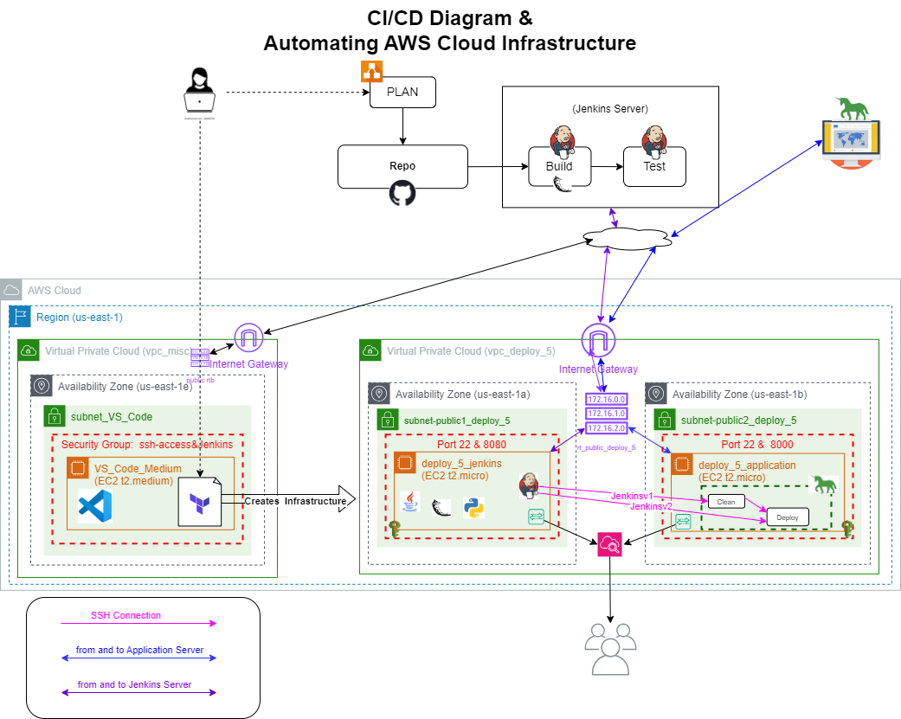
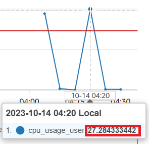
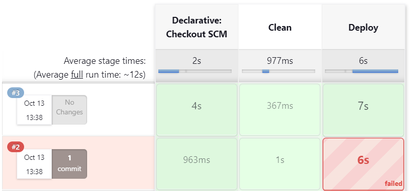
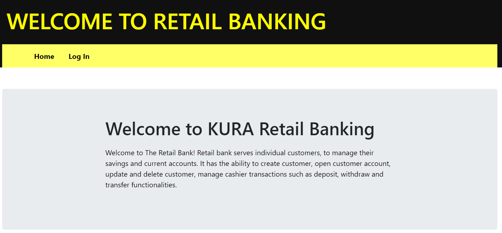
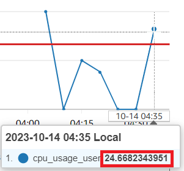

# Run a Jenkins Build for a Banking Application and Deploy it to a second instance using SSH

October 13, 2023

By:  Annie V Lam - Kura Labs

# Purpose

SSHing to a separate server for application deployment.

Previously, we manually built, tested, and deployed our web application on a single server. In our updated deployment process, we utilize Terraform to create the infrastructure. However, we now build and test the application on one server before SSHing into a second server for the deployment process.

## Step #1 Diagram the VPC Infrastructure and the CI/CD Pipeline



## Step #2 GitHub/Git

**GitHub Repository and Jenkins Integration:**

GitHub serves as the repository from which Jenkins retrieves files to build, test, and deploy the URL Shortener application.

**Changes in the repository for Jenkins Build Deploy_5v1**

In this deployment, we need to make edits to the Jenkinsfilev1 ["Deploy"](Images/Jenkinsfilev1.png) block to achieve the following tasks:

```
Securely copy the file "setup.sh" from the Jenkins Server to the Application Server.
SSH into the Application server.
Run the "setup.sh" script in the Application server.
```
In the [setup.sh](Images/setup_sh.png) file, make the following updates:

```
Clone the repository from https://github.com/LamAnnieV/deploy_5.git.
Change the working directory to the correct location of the locally cloned repository.
```

**Changes in the repository for Jenkins Build Deploy_5v2**

After successfully deploying the application, edit the Jenkinsfilev2 ["Clean"](Images/Jenkinsfilev2.png) block to perform the following actions:

```
Securely copy the file "pkill.sh" from the Jenkins Server to the Application Server.
SSH into the Application server.
Run the "pkill.sh" script.
```

Edit the Jenkinsfilev2 ["Deploy"](Images/Jenkinsfilev2.png) block to perform the following actions:

```
Securely copy the file "setup.sh" from the Jenkins Server to the Application Server.
SSH into the Application server.
Run the "setup.sh" script in the Application server.
```

Update the ["setup2.sh"](Images/setup_sh.png) file to:

```
Delete the previous repository, deploy_5
Clone the repository from https://github.com/LamAnnieV/deploy_5.git.
Update the working directory to deploy_5
```

For the purpose of testing the second build, make updates to [home.html](Images/home.html_edit.png) file.

In order for the EC2 instance, where Jenkins is installed, to access the repository, you need to generate a token from GitHub and then provide it to the EC2 instance.

[Generate GitHub Token](https://github.com/LamAnnieV/GitHub/blob/main/Generate_GitHub_Token.md)

## Step #3 Automate the Building of the Application Infrastructure 

For this application infrastructure, we want:  

```
1 VPC
2 Availability Zones
2 Public Subnets
2 EC2 Instances
1 Route Table
2 Security Group 
  -one with ports: 22 and 8000
  -another with ports: 22 and 8080
```
To automate the construction of the application infrastructure, employ an instance equipped with VS Code and Terraform. The [main.tf](Images/main.tf) and [variables.tf](Imaages/variables.tf) files, define the resources to be created and declare variables. Additionally, Terraform enables the execution of installation scripts. In the case of one instance, an installation script was utilized for [installing Jenkins](Images/instance_1_installs.sh).

**Jenkins**

Jenkins is used to automate the Build, Test, and Deploy the Banking Application.  To use Jenkins in a new EC2, all the proper installs to use Jenkins and to read the programming language that the application is written in need to be installed. In this case, they are Jenkins, Java, and Jenkins additional plugin "Pipeline Keep Running Step", which is manually installed through the GUI interface.


## Step #4 Establish a SSH Connection from the Jenkins Server to the Application Server

While the Jenkins Server initiates the deployment process for the application, it does not perform the deployment itself. Instead, it establishes an SSH connection to the application server and runs a script to deploy the application. To accomplish this, an SSH connection is established using a Jenkins User account.
 
**Command to establish SSH Connection as Jenkins user: **

```
#In the Jenkins Server run the following bash commands
sudo passwd jenkins
sudo su - jenkins -s /bin/bash
ssh-keygen  #This will generate the public key to /var/lib/jenkins/.ssh/id_rsa.pub
#Copy the public key from the file id_rsa.pub
#Paste the key in /home/ubuntu/.ssh/authorized_keys file
#Then in the Jenkins server as a Jenkins user, run the command below to test the SSH connection
ssh ubuntu@application_server_ip_address
```
**SSH Connection was made:**


To avoid exposing the IP address in GitHub and enable SSH automation, the IP address of the Application server is stored in a file within the Jenkins server, which can be conveniently referenced later.

## Step #5 Other Installation

In both instances, as an ubuntu user, install the following:

```
sudo apt update
sudo apt install -y software-properties-common 
sudo add-apt-repository -y ppa:deadsnakes/ppa 
sudo apt install -y python3.7 
sudo apt install -y python3.7-venv
```

## Step #6 Configure CloudWatch and Create Alarms to Monitor Resources

CloudWatch is used to monitor our resource usage in our instance.

[Install/Configure CloudWatch](https://docs.aws.amazon.com/AmazonCloudWatch/latest/monitoring/install-CloudWatch-Agent-on-EC2-Instance-fleet.html)

Alarms allow you to set thresholds in CloudWatch, which will notify you when those thresholds are breached.

[How to create a CloudWatch alarm](https://docs.aws.amazon.com/AmazonCloudWatch/latest/monitoring/ConsoleAlarms.html)

## Step #7 Configure Jenkins Build and Run Build

Please refer to the diagram [here](Images/GitHub_Diagram.drawio.png) for the repository edits, commits, and Jenkins build run process.

**"deploy_5v1" Build**

[Create Jenkins Multibranch Pipeline Build](https://github.com/LamAnnieV/Jenkins/blob/main/Jenkins_Multibranch_Pipeline_Build.md)

Jenkins Build:  In Jenkins create a build "deploy_5v1" to run the file Jenkinsfilev1 for the Banking application from GitHub Repository [https://github.com/LamAnnieV/deployment_4.git](https://github.com/LamAnnieV/deploy_5.git) and run the build.  This build consists of:  The Build, the Test, the Clean, and the Deploy stages.

Please refer back to "Edit to the Jenkinsfilev1" and "Edit to the setup.sh" above for changes.

**Result**

Jenkins build "deploy_5" was successful:


This image shows the CPU utilization of the Jenkins server under a stress test. It is running 'sudo stress-ng --matrix 1 -t 1m' while concurrently executing a Jenkins build.



**The Jenkinsfilev2 was ran as a different build under the name "deploy_5v2"**

Jenkins Build:  In Jenkins create a build "deploy_5v1" to run the file Jenkinsfilev1 for the Banking application from GitHub Repository [https://github.com/LamAnnieV/deployment_4.git](https://github.com/LamAnnieV/deploy_5.git) and run the build.  This build consists of the Clean and the Deploy stages.  Jenkinsfilev1 primarily serves the purpose of testing, ensuring that new code changes and configurations work as intended. Conversely, Jenkinsfilev2 is typically associated with the staging or production environment. The decision to separate them is driven by best practices in software development and deployment.

Jenkins build "deploy_5v2" was successful, however launching of the second branch does not reflect the changes made in home.html.  After merging the second branch to the main branch the website was launched reflected the changes made in the file home.html

Please refer back to edit to the Jenkinsfilev2,  edit to the setup2.sh" above for changes.

**Result**

Jenkins build "deploy_5.1" took multiple attempts before the build was successful:





This image shows the CPU utilization of the Application server under a stress test. It is running 'sudo stress-ng --matrix 1 -t 1m' while concurrently executing a Jenkins build.



## Issue(s)

Most of the challenges revolved around the development process, including writing and testing code, identifying bugs, and debugging code within the Terraform files, as well as the edits made in the Jenkinsfiles and setup files

There was an issue with testing the 'Deploy_5v2' build. In the script, a line is responsible for cloning the repository onto the application server, with the expectation that it replicates the second branch of the repository. Unfortunately, there was an inconsistency observed with the 'home.html' file, located in a subfolder. The cloned 'home.html' file on the application server did not match the version in the second branch of the repository; instead, it reflected the 'main' branch. However, after merging the second branch into the main branch, the launched webpage correctly reflected the changes made to 'home.html'.

## Conclusion

As observed in the CloudWatch images, even when both servers were subjected to 'sudo stress-ng --matrix 1 -t 1m' while simultaneously running Jenkins builds, the CPU usage exceeded 20%, although it remained below 30%. This performance level is adequate as long as the servers are not consistently stressed, do not require more than 2 CPUs, and do not experience a substantial surge in requests. Nonetheless, it's advisable to explore options for additional resources as a precaution.

In this deployment, two instances are employed: one for the Jenkins server and the other server is for the web tier. Both instances are placed in the public subnet, as they need to be accessible via the internet. The Jenkins server is accessible through port 8080 for utilizing the Jenkins GUI interface, while the application server is accessible by our banking customers through port 8000. Thus, both subnets must remain public for these connections to function as required.  However, if we pull out the application tier and database tier into their own server, then that server can be on the private subnet.
  
## Area(s) for Optimization:

-  Enhance automation of the AWS Cloud Infrastructure by implementing Terraform modules.

Note:  ChatGPT was used to enhance the quality and clarity of this documentation
  
